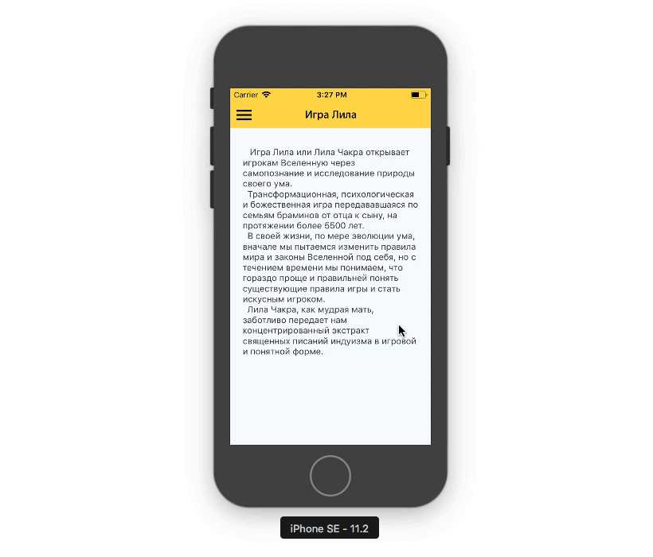

# Book reader 
### React-Native



# Clone project 
```sh
git clone https://github.com/react-native-village/bookreader.git 
```

# Navigate to the project
```sh
cd bookreader 
```

# Set dependencies 
```sh
yarn install
```

# Run the following command in a Terminal
##### for iOS
```sh
react-native run-ios
```

##### for Android 
```sh
react-native run-android
```
